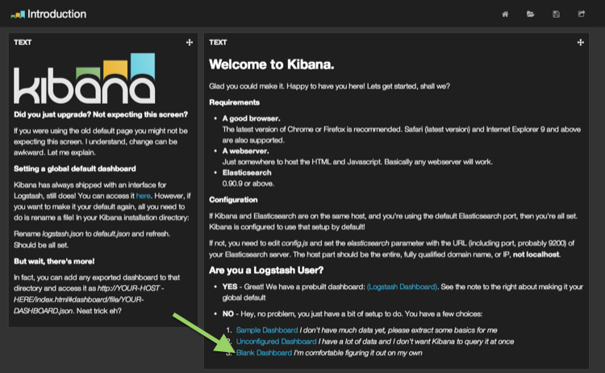
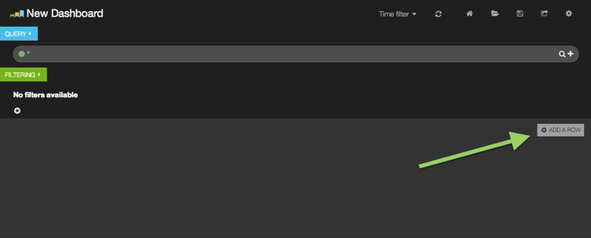
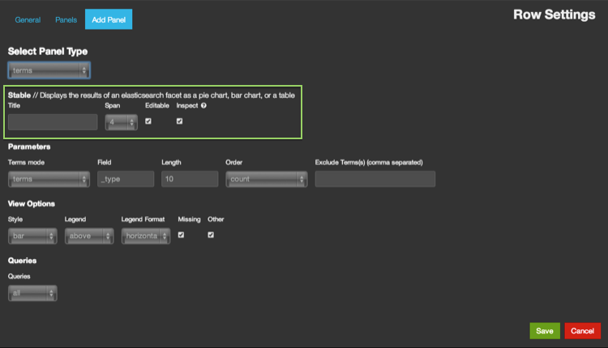
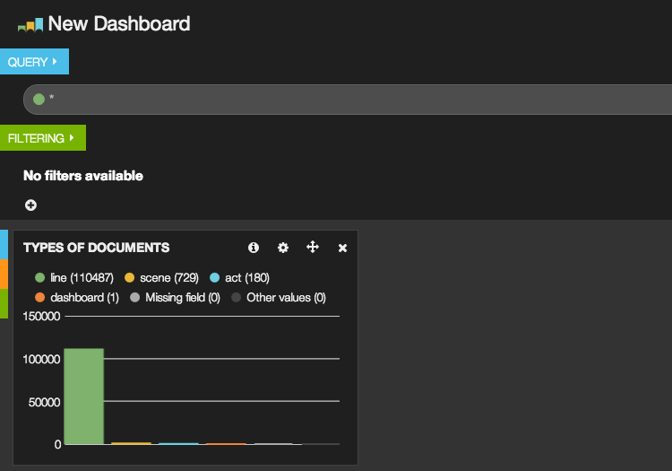
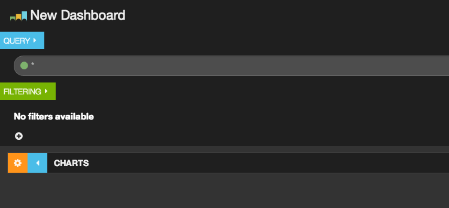
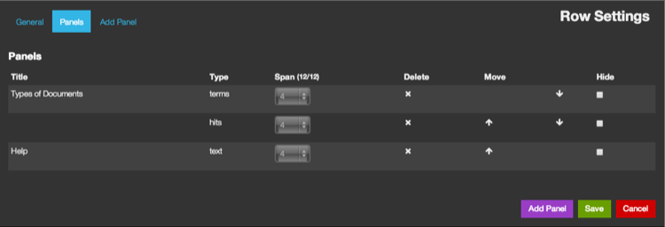
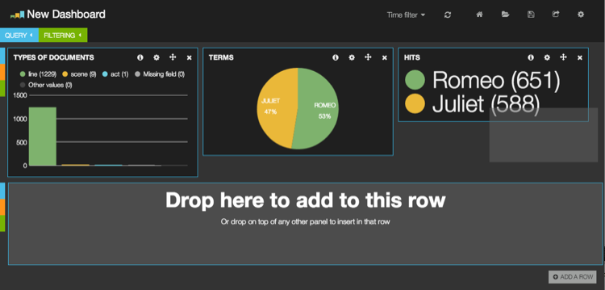
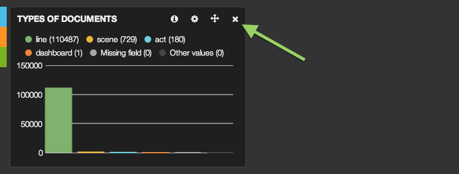

## Working with Rows and Panels

Kibana's dashboards are organized into a system of rows and panels. These can be added, removed and rearranged to suite your needs.

In this tutorial we will cover:

- Loading a blank dashboard
- Adding, sizing and hiding rows
- Adding and sizing panels
- Removing panels and rows

We will assume you have already:

- Installed Elasticsearch on your workstation
- Have webserver installed on your workstation and have the distribution extracted into the configured document root.
- Have read [Using Kibana for the first time](../intro/index.html) and have the `shakespeare` index populated with the data from the tutorial.

### Loading a blank dashboard

From the homescreen, select option #3, this will load a Blank Dashboard. By default, the blank dashboard is configured to look at Elasticsearch's `_all` index, which points to all of your indices. If you would like to configure Kibana to point at a different index, see [Using Kibana for the first time](../intro/index.html)

### Adding a row

Your new blank dashboard will appear with the query and filter sections expanded, a time filter input in the navigation bar at the top, and not a whole lot else. Click the **Add a row** button on the right to add your first row.

Give your row a title and click **Create Row**. You will see your new row appear in the list of rows to the left. Click **Save**

### The row controls

Now that you have a row, you will notice a few new elements on your dashboard. Chiefly the 3 brightly colored rectanges to the left. Move the mouse over them

Ah hah! these buttons allow you to accomlish 3 things

- Collapsing rows (blue)
- Configuring rows (orange)
- Adding panels (green)

### Adding panels

For now we'll focus on the *green* button in the row controls. Give it a try. You can also click the *grey* button labeled **Add panel to empty row**, but it's grey, and what fun is that?

Let's add a **terms** panel. The **terms** panel allows us to make use of the Elasticsearch **terms facet** to find the most popular values in a field. 

As you can see, the terms panel has a number of optional settings, however we'll focus on the general settings in the first section for now:

1. Title: The name for this panel
2. Span: The width of the panel. Kibana dashboards are made of 12 equally sized *spans*. Panels can be up to 12 spans wide. Rows can contain more than a total of 12, with new panels wrapping to the next line. Leave this at 4 for now.
3. Editable: If this panel is configurable later. Leave this checked for now.
4. Inspectable: If the user can view the query used for this panel. Also leave this checked for now.
5. Click **Save** to add your new **terms** panel to your dashboard

Great! Now you have a panel! You may recognize this breakdown of data from the pie chart in [Using Kibana for the first time](../intro/index.html). The `shakespeare` data set is comprised largely of lines of speech, with a few markers between acts and scenes thrown in there.

### Collapsing and expanding rows

The blue button collapses your rows. Panels in collapsed rows do not refresh data and thur require no Elasticsearch resources to keep around. Collapsed rows are great for data that you don't need to see often. Click the blue button again to expand the row. 

The query and filter sections at the top can also be collapsed. Click the colored label to collapse and expand

### Editing rows

Rows can be renamed, resized and edited via the row editor. Click the orange cog icon button to open the row editor. 

The same dialog also allows you to change the order and size of panels, as well as remove them. 

### Moving and Removing panels

Panels can be dragged and dropped within their own row, or into another row, by dragging the crosshair shaped move icon in the top right of the panel.

Click the *remove* icon in the top right of a panel to remove it from the dashboard. Panels can also be removed from the row editor. 

### Moving and Removing Rows

Rows can be re-ordered and removed via the dashboard configuration screen. Click the cog in the top left of the screen, and select the **Rows** tab to make changes to the row layout. You may remember this screen from when we added our first row. 

The arrows to the left allow you to change the order of the rows on your dashboard. The **X** is used to remove rows.

### Next steps

Before you close your browser you might want to save this new dashboard. See [Saving and Loading dashboards](../saving/index.html)